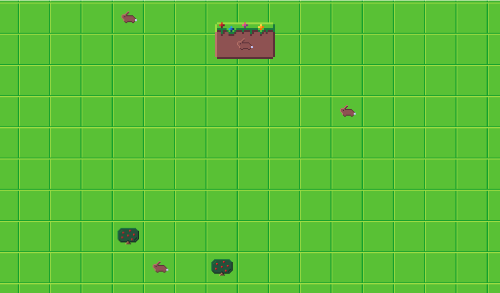

# AI_Playground
This project is very much in progress. 
It is all about AI. I hope to learn a ton about designing complex systems. 
Currently I'm working on adding my first AI to the game. This creature will be a bunny. 

## Overview/Roadmap
The world will be randomly generated with grass tiles. (Water tiles will come soon) 
You have a bar at the top, this bar has a selection of creatures... or at least... it will. (Currently one bunny) 
Drag a creature from the bar onto a tile on the map to spawn an instance of that creature. 
Once the creature is added to the world it will search for food, water, and mating. 

## Current Issue
Currently I am working on the first AI. 
My inital design for the bunny AI had bad weights. 
Essentially this caused my bunny to roam while it was not hungry. 
However when the bunny became hungry the AI prioritized tiles closer to itself. 
If the bunny became too hungry, and did not see food in range, it would sit on its own tile 

## Lessons Learned So Far
Designing a mathematical equation for my AI's weights needs to be done with care. 
My first attempt I put very little thought into how the weight values were being picked. 
Which... backfired.
